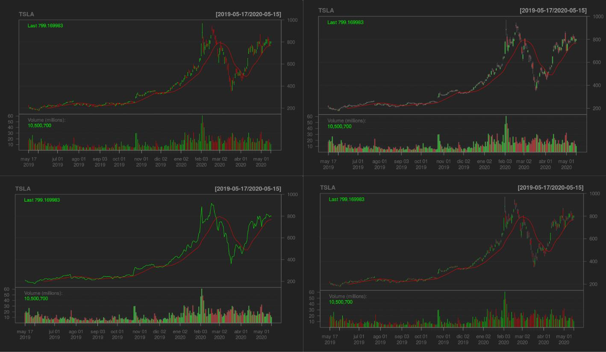

```{css echo=FALSE}
<style>
slides > slide.title-slide p { color: darkred;}
slides > slide.title-slide hgroup h1 { color: darkred;}
slides > slide hgroup h2 { color: darkred;}
</style>
```    


```{r setup, include=FALSE}
knitr::opts_chunk$set(echo = FALSE)

require(quantmod)

```

## Introduction {.smaller}

This presentation made with slidify is the second part of the 4th Week Assignment 
for the Coursera's *Developing Data Products* Course from the 
*Data Science Specialization*.

In the first part of the Assignment, I have created the shinyapp named
*Yahoo Finance Visualizer*. You can find it on url below:


https://dpellon.shinyapps.io/Yahoo_Finance_Visualizer/


The application allows to basically display Stock Instruments from Yahoo Finance
with some configuration options.

Next slides will provide further information on the details.


## Example Chart {.smaller}


```{r, comment ="", echo=TRUE, fig.align='center',message=F,warning=FALSE} 
chartSeries(getSymbols('AAPL',src="yahoo",auto.assign=F,from=Sys.Date()-365,
    to=Sys.Date()),type='candlesticks',theme='black',name='AAPL')
```

## Configuration Options {.smaller}


- It is possible to specify different types of Moving Averages, their colours and configuration periods. Types are: 
     - SMA
     - EMA
     - WMA
     - EVWMA
     - ZLEMA
     
- You can also switch between different types of standard financial charts : 
     - Candlesticks
     - Matchsticks
     - Bars
     - Line


## Example of different configurations {.smaller}


```{r, comment ="", echo=FALSE, fig.align='center'} 


```